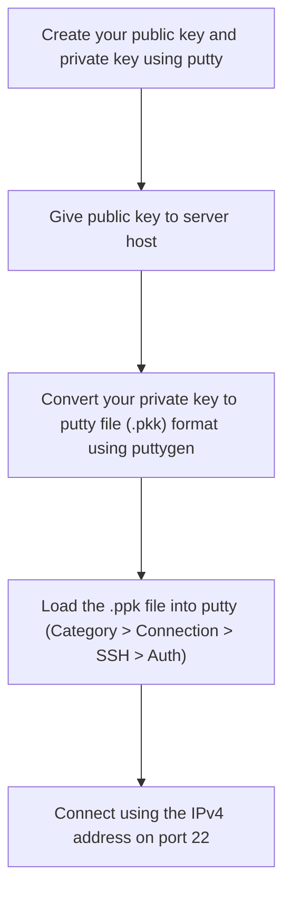

**Do not go with IPv6 - you need IPv4**

Reason: Putty cannot ssh to an IPv6 server. It simply does not support IPv6 connection. I tried using square brackets and tried using both port 22 and 222, but nothing worked. From then on, I could only use the terminal built into the Hetzner web-interface, which was terrible, as all the keys were mapped differently, than what I am used to. Also, the resolution was bad.

Filezilla is said to have inbuilt IPv6 support, but this can only be used for managing files. I could not get that to work though, and the Hetzner documention only mentions FTP/FTPS support for their "Storage Box" products.

**Normal workflow when connecting to a new server for the first time:**

Now in order to update the list of ubuntu packages that you can install:

> sudo apt-get update

**Installing Jekyll**

> sudo apt-get install ruby-full build-essential zlib1g-dev

From the Jekyll website:

*Avoid installing RubyGems packages (called gems) as the root user. Instead, set up a gem installation directory for your user account. The following commands will add environment variables to your ~/.bashrc file to configure the gem installation path:*

> echo '# Install Ruby Gems to ~/gems' >> ~/.bashrc

> echo 'export GEM_HOME="$HOME/gems"' >> ~/.bashrc

> echo 'export PATH="$HOME/gems/bin:$PATH"' >> ~/.bashrc

> source ~/.bashrc

Now install Jekyll: 

> gem install jekyll bundler

Create a Jekyll site:

> jekyll new my-awesome-site

> cd my-awesome-site

Add "#" to the beginning of the line that starts with gem "jekyll" to comment out this line.

Add the github-pages gem by editing the line starting with # gem "github-pages". Change this line to:

> gem "github-pages", "~> GITHUB-PAGES-VERSION", group: :jekyll_plugins

Replace GITHUB-PAGES-VERSION with the latest supported version of the github-pages gem. You can find this version here: "Dependency versions."

From the command line, run: 

> bundle install.

Now to export it to you local PC, open a local CMD session and type:

> scp -r root@5.75.230.166:/root/my-awesome-site -r "C:\Users\ATVQ\OneDrive - Novo Nordisk\Desktop"

Now upload the folder to you github pages repo and view it in the browser.
