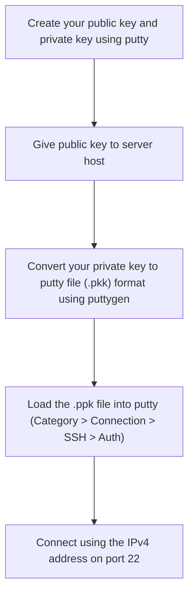

Putty cannot ssh to an IPv6 server. Tried using square brackets, using port 222 but nothing worked.

Filezilla is said to have inbuilt IPv6 support

**Normal workflow when connecting to a new server for the first time:**

