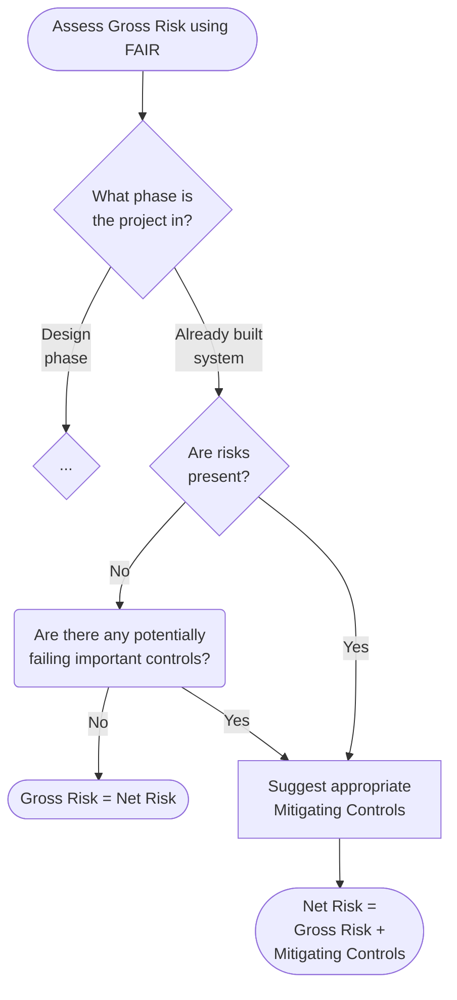

<!-- ## Assessing IT risk based standard URS requirements -->
## Motivation

Section 16 in [EU GMP Annex 11](index.md) states that computerized systems must be risk assessed to ensure a stable business process:

_For the availability of computerised systems supporting critical processes, provisions should 
be made to ==ensure continuity== of support for those processes in the event of a system 
breakdown (e.g. a manual or alternative system). The time required to bring the alternative 
arrangements into use should be ==based on risk== and appropriate for a particular system and the 
business process it supports. These arrangements should be adequately documented and tested_

Federal agencies mandates these assessments, as a sudden production stop could mean a drug shortage, thereby endangering lives.

## When to perform a Risk Assessment?
A risk assessment is most usefull in the design phase, as incorporating risk controls is easiests in this stage, 
but risk assessment should also be made on finished systems to address changes and new industry trends.

# How it is performed?
{ loading=lazy width=50% } 
Focus is on assessing the likelyhood and impact of potential risks. Companies sometimes use standard spreadsheets, 
which then automatically calculates the gross risk.

## Step 1: Assessing Gross Risk
### Defining the system state
Gross risk, also called inherent risk, is the amount of risk present, when risk controls are not accounted for. 
But what features constitute risk controls and what are fundemental aspects of a system? Without drawing the line somewhere, 
one trying to assess gross risk can keep stripping down a system until nothing is left.

The most practical approach, is to define the gross risk of a system, as the 
_current risk level given the existing set of controls rather than the hypothetical notion of an absence of any controls_[^1].
### Assessing the risk
Other than finding security holes, one should assess the risk and consequence of existing risk controls failing.

[^1]:  Rachel Slabotsky, FAIR Institute, acessed 2023.02.16 from [link](https://www.fairinstitute.org/blog/inherent-risk-vs.-residual-risk-explained-in-90-seconds).
<!-- 
## Step 2: Implementing Risk Controls

This implies two things:

* For systems still in the design phase, the system in its currently fleshed out design should be looked upon as the gross risk state.
* For already built systems, the gross risk state is the physical system as it is.

## Using the Risk Assessment tool for planning validation activities
### Determine relevant IT risk controls to test during validation of an IT system after implenting changes
1. Determine which of the listed generic IT URS requirement are likely to be impacted by the change.
2. From these URS requirements, selected the corresponding IT risk controls, which have been implemented for the current system, and which might be affected by the planned activities.
3. Use your knowledge of the IT system to formulate the test-steps needed to ensure that these risk controls work as intended.

-->