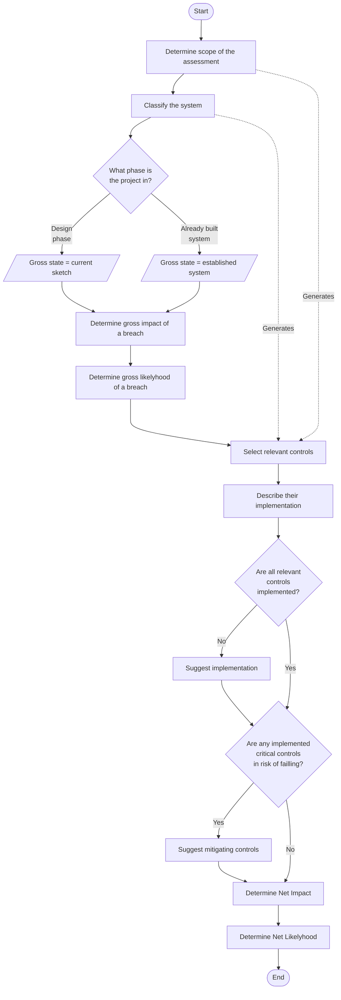
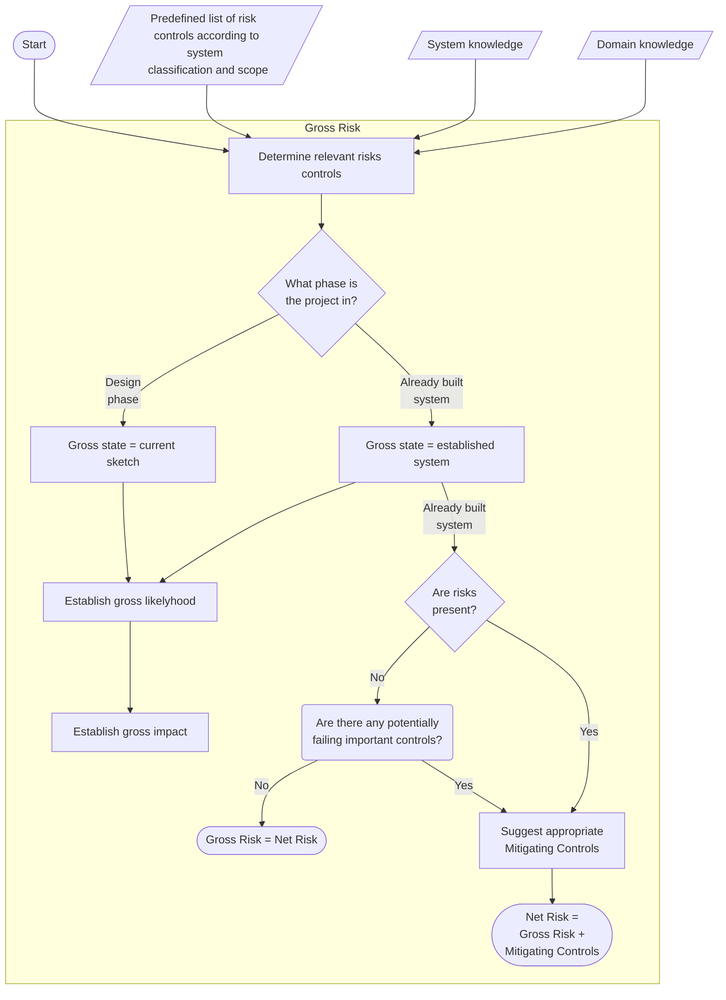

---
hide:
  - toc
---

```mermaid
graph TD
	A([Start]) --> B
	B[Determine scope of the assessment] --> C
	C[Classify the system] --> D
	D{What phase is <br> the project in?}
		D -->|Design <br> phase| E
		D -->|Already built <br> system| F
	E[/Gross state = current sketch/] --> G
	F[/Gross state = established system/] --> G
	G[Determine gross impact of a breach] --> H
	H[Determine gross likelyhood of a breach] ---> I
	I[Select relevant controls] --> J
		B -. Generates .-> I
		C -. Generates .-> I
	J[Describe their implementation] --> K
	K{Are all relevant <br> controls <br> implemented?}
		K --> |No | L
		K --> |Yes| M
	L[Suggest implementation] --> M
	M{Are any implemented <br> critical controls <br> in risk of failling?}
		M --> |Yes| N
		M --> |No | O
	N[Suggest mitigating controls] --> O
	O[Determine Net Impact] --> P
	P[Determine Net Likelyhood] --> Q
	Q([End])
	
	
	
	

```

<!--

```mermaid
graph TD
	A([Start]);
	A --> CC[Determine relevant risks controls]
	BB[/Predefined list of risk  <br> controls according to system <br> classification and scope/] --> CC
	CCD[/System knowledge/] --> CC
	CCE[/Domain knowledge/] --> CC
		
	subgraph "Gross Risk"
		CC --> DD{What phase is <br> the project in?};
		DD -->|Design <br> phase| EE[Gross state = current sketch] --> GG
		DD -->|Already built <br> system| FF[Gross state = established system] --> GG;
		GG[Establish gross likelyhood]
		GG --> HH[Establish gross impact]
		
		
			FF -->|Already built <br> system| E{Are risks <br>present?};
			E -->|No| F(Are there any potentially <br>failing important controls?);
			F -->|No| I([Gross Risk = Net Risk])
			F -->|Yes| G
			E -->|Yes| G[Suggest appropriate <br>Mitigating Controls]
			G --> H(["Net Risk = <br>Gross Risk + <br>Mitigating Controls"])
		
	end
	
```
-->