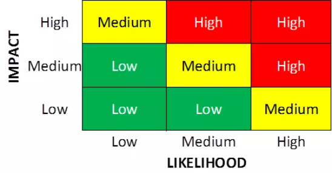

# How it is performed?
{ loading=lazy width=50% } 

Focus is on assessing the likelyhood and impact of potential risks. Companies sometimes use standard spreadsheets, 
which then automatically calculates the gross risk.