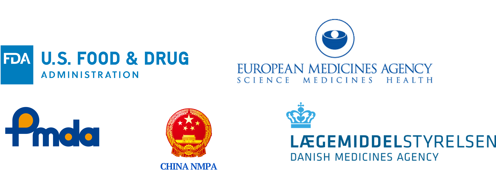
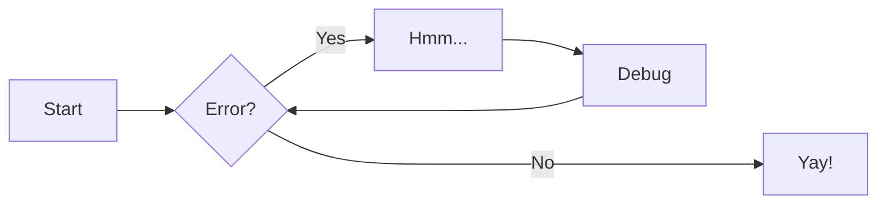

# Compliance & its role in pharma


## What is Compliance and _GMP_?
The word _compliance_ is often used in the industry by itself, but what is really meant is _compliance with federal regulations_. 
GMP is a term commonly used in the pharma industry. It stands for _Good Manufacturing Practices_ and despite 
the seemingly general wording, GMP a term virtually exclusive to the pharma industry. Words commonly used interchangebly with GMP are:

* cGMP - Current Good Manufacturing Practices.
* GxP - Good x Practices, where x stands for different sub-areas within the industry.
* cGxP - Current Good x Practices.

There are small variations, but the overall meaning is the same - following federal regulations.

## What does compliance have in pharma?
Pharmaceutical companies - especially those manufacturing drugs for injection - are subject to some of the strictest 
laws across all industries. This is reflected inside the workplaces, by most of the task not directly related to ensuring 
production revolving around ensuring compliance.

## The regulations defining compliance


### US regulations
The FDA regulatory requirements are seen as the most important laws to comply with, and these are found in 
_FDA CFR, Title 21, Part 11 - Electronic Records & Signatures_.

This [link](https://www.ecfr.gov/current/title-21/chapter-I/subchapter-A/part-11) takes you to the full text.


### EU regulations
These are found in _EudraLex (EMA), Volume 4 (GMP), Annex 11 - Computerised Systems_, which is often abbreviated as _EU GMP Annex 11_.

The full text can be found [here](https://health.ec.europa.eu/system/files/2016-11/annex11_01-2011_en_0.pdf), 
and the entire annex only consists of 5 pages.

### Other national agencies
Other countries often look towards the FDA and EU requirements, when forming their own sets of requirements.

Some of the other national pharmaceutical regulatory agencies, 
which companies must adhere to if they wish to operate in these markets, include the Japanese PMDA and the Chinese NMPA.


<!-- The high degree of desired regulatory controll of governmental agencies, mean that laws governing daily life on
pharmaceutical plants are very encompassing. This entails describing most actions through SOPs - Standard Operating Procedures. -->


<!-- _Software validation is part of the computerized systems validation (CSV) process._ -->

<!--


```
Q043672 - Production of Sterile Medicinal Products by Aseptic Processing - Rules and Guidance
Q0300353 - Plan and Conclude Validation Activities in Projects	
Q166087​ - Quality Manual 
Q139973 - Regulatory GMP requirements, standards and guidelines in PS Biotech & Rare Disease

https://novonordisk.sharepoint.com/sites/NNQ/SitePages/Process-landscape.aspx

QMS
	Processes
	Procedures
		SOPs
	
	Quality Risk Management
	Batch documentation
	Configuration management
		CS/CIL/DS
	System Verification / Validation
		URS document
		Deviations
			Major and minor
			CAPA
				SPS, LEAN, HoC

		CR
			1-1 replacements
			Changes
				Internal testing
			New equipment
				FAT, SAT, Internal testing
```
-->