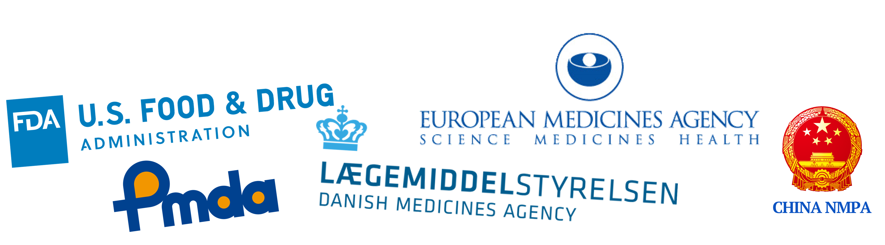

---
hide:
  - toc
---

# The Regulations Defining Compliance
<!-- { style="max-width: 70%" } -->
{class="post-image"}

### US regulations
The FDA regulatory requirements are seen as the most important laws to comply with, and these are found in 
_FDA CFR, Title 21, Part 11 - Electronic Records & Signatures_.

This [link](https://www.ecfr.gov/current/title-21/chapter-I/subchapter-A/part-11) takes you to the full text.

An official implementation guidance document for the industry can be found [here](https://www.fda.gov/regulatory-information/search-fda-guidance-documents/part-11-electronic-records-electronic-signatures-scope-and-application).

### EU regulations
{class="post-image"}
These are authored by the Directorate-General for Health and Food Safety and are found in _EudraLex (EMA), Volume 4 (GMP), Annex 11 - Computerised Systems_, which is often abbreviated as _EU GMP Annex 11_.

The full text can be found [here](https://health.ec.europa.eu/system/files/2016-11/annex11_01-2011_en_0.pdf) (5 pages).

### Other national agencies
Other countries often look towards the FDA and EU requirements, when forming their own sets of requirements.

Some of the other national pharmaceutical regulatory agencies, 
which companies must adhere to if they wish to operate in these markets, include the Japanese PMDA and the Chinese NMPA.

