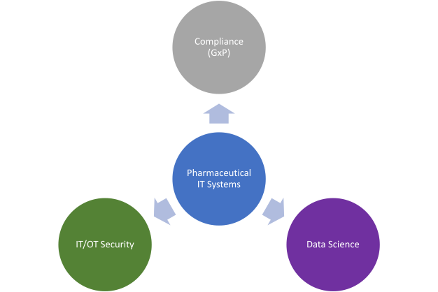

# Introduction to this website
{ style="float: right; max-width: 20%; border-radius: 10%;"}

Welcome to my blog on IT in the pharmaceutical industry. 
My name is Attila Vural, and I am excited to share my insights and experiences with you on the 
intersection of regulatory compliance, IT security, and data science in this atypical field.

Click on the topics on the figure below to read more.

<!-- Image Map Generated by http://www.image-map.net/ -->

<map name="image-map">
    <area target="" alt="" title="" href="security" coords="151,351,67" shape="circle">
    <area target="" alt="" title="" href="gxp" coords="314,69,66" shape="circle">
    <area target="" alt="" title="" href="python" coords="476,349,67" shape="circle">
</map>

<!--
```
Q043672 - Production of Sterile Medicinal Products by Aseptic Processing - Rules and Guidance
Q0300353 - Plan and Conclude Validation Activities in Projects	


QMS
	Processes
	Procedures
		SOPs
	
	Quality Risk Management
	Batch documentation
	Configuration management
		CS/CIL/DS
	System Verification / Validation
		URS document
		Deviations
			Major and minor
			CAPA
				SPS, LEAN, HoC

		CR
			1-1 replacements
			Changes
				Internal testing
			New equipment
				FAT, SAT, Internal testing
```
-->