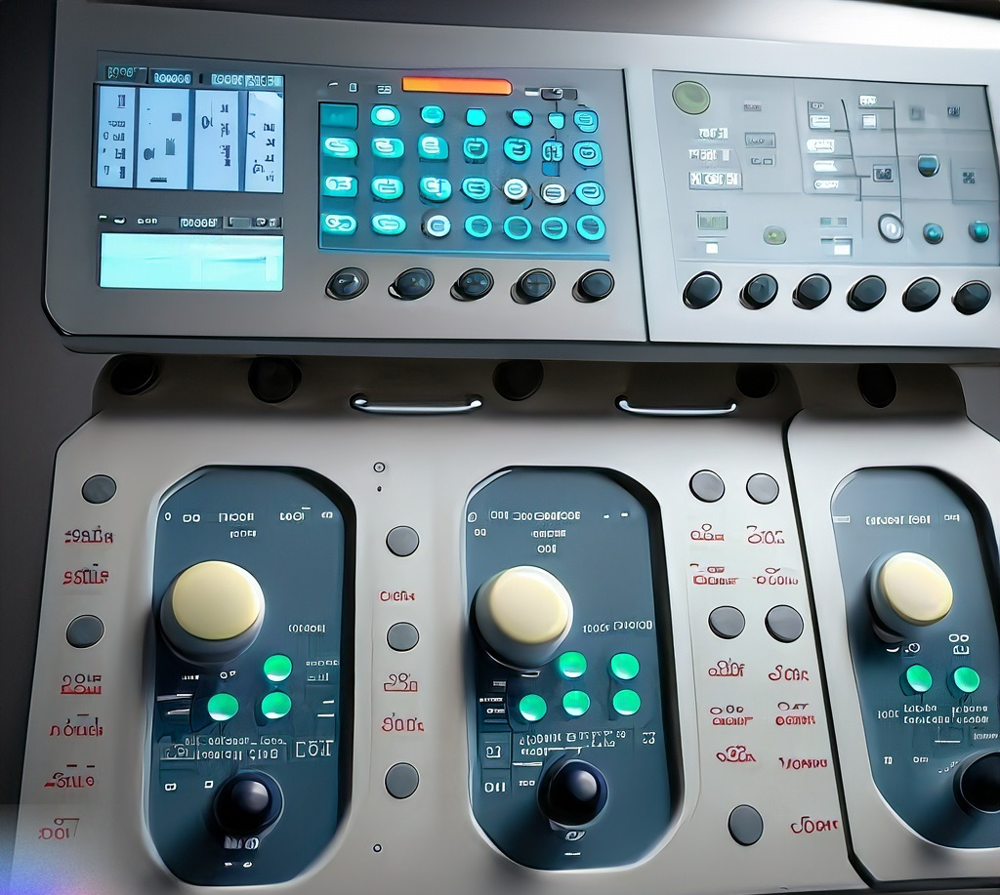

---
hide:
  - toc
---

# Motivation

{class="post-image"}

Manual tasks required to maintain IT security and integrity of GxP data and signatures must be described in an instruction, sometimes referred to as the'Operation & maintenance instruction'.

This is mandated in CFR part 21 section xxxx.....

These include topics such as:

* Process for security patching
* Security log review
* IT Incident management
* User management
* Change management
* Configuration management 
* Backup/restore
* IT recovery process

