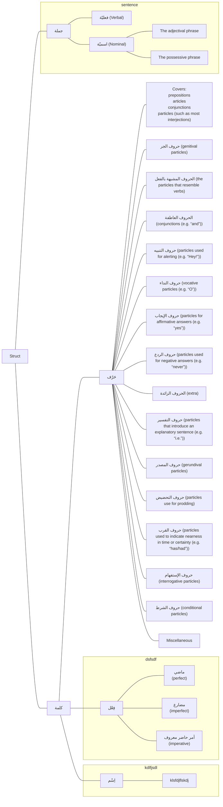

```mermaid
flowchart LR
    A[Struct]
        A---B1[كلمة]
            B1---C11["اِسْم"]
            subgraph kdlfjsdl
                C11---D3.1[klsfdjflskdj]
            end
            B1---C12["فِعْل"]
            subgraph dsfsdf
                C12---D11["ماضي <br />(perfect)"]
                C12---D12[" مضارع <br />(imperfect)"]
                C12---D13["أمر حاضر معروف <br />(imperative)"]
            end
            B1---C13["حَرْف"]
                C13---D2.1["Covers:<br />prepositions<br />articles<br />conjunctions<br />particles (such as most interjections)"]
                C13---D2.2["حروف الجر (genitival particles)"]
                C13---D2.3["الحروف المشبهة بالفعل (the particles that resemble verbs)"]
                C13---D2.4["الحروف العاطفة (conjunctions (e.g. “and”))"]
                C13---D2.5["حروف التنبيه (particles used for alerting (e.g. “Hey!”))"]
                C13---D2.6["حروف النداء (vocative particles (e.g. “O”))"]
                C13---D2.7["حروف الإيجاب (particles for affirmative answers (e.g. “yes”))"]
                C13---D2.8["حروف الردع (particles used for negative answers (e.g. “never”))"]
                C13---D2.9["الحروف الزائدة (extra)"]
                C13---D2.10["حروف التفسير (particles that introduce an explanatory sentence (e.g. “i.e.”))"]
                C13---D2.11["حروف المصدر (gerundival particles)"]
                C13---D2.12["حروف التحضيض (particles use for prodding)"]
                C13---D2.13["حروف القرب (particles used to indicate nearness in time or certainty (e.g. “has/had”))"]
                C13---D2.14["حروف الإستفهام (interrogative particles)"]
                C13---D2.15["حروف الشرط (conditional particles)"]
                C13---D2.16["Miscellaneous"]
        A---B2[جملة]
            subgraph sentence
            B2---C21["فعليّة (Verbal)"]
            B2---C22["اسميّة (Nominal)"]
                C22---D41["The adjectival phrase"]
                C22---D42["The possessive phrase"]
            end
```
            
