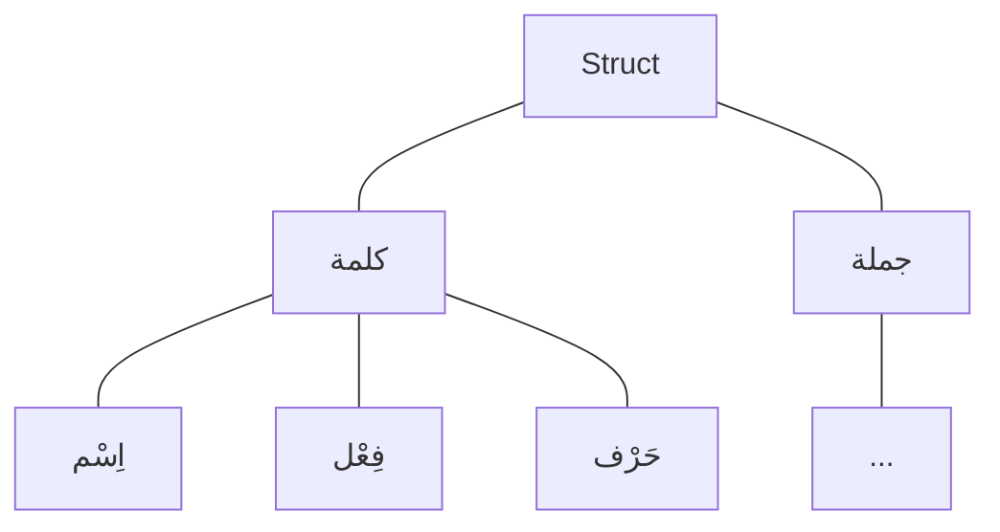

```mermaid
graph TD
    A[Struct]
        A---B[كلمة]
            B---C1["اِسْم"]
            B---C2["فِعْل"]
            B---C3["حَرْف"]
        A---D[جملة]
            D---E1["..."]
            

```
